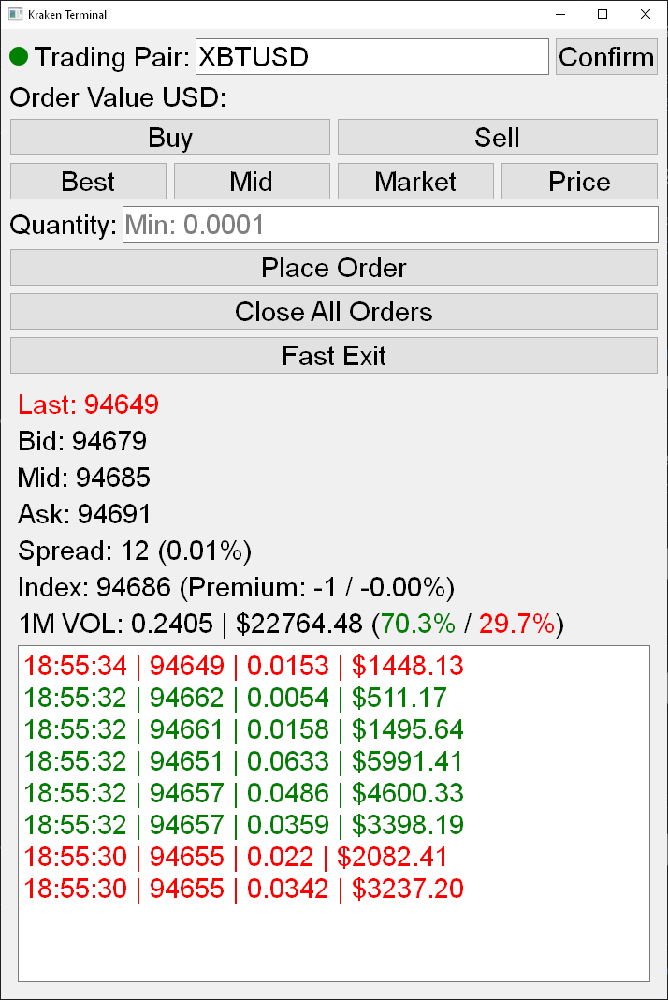

# krakenfutures-terminal
A lightweight, real-time trading terminal for Kraken Futures.

Key Features:

- Low memory, lightweight application
- Real-time WebSocket price data and order book updates
- 1-minute volume tracking
- Position management with unrealized P&L tracking
- Smart price selection: Best price/Mid price
- Fast position exit with one-click market orders
- Recent trades display
- Bulk order cancellation
- Connection status indicator

The terminal focuses on speed and efficiency, displaying all crucial trading information in a single window while maintaining a clean, uncluttered interface. 
Perfect for traders who need quick market access without the complexity of full-featured trading platforms.

Built with Python using ccxt for exchange connectivity and PyQt5 for the user interface.

